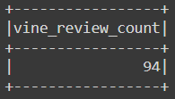
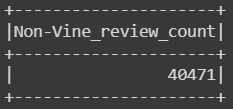
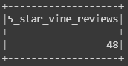
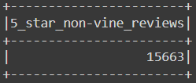
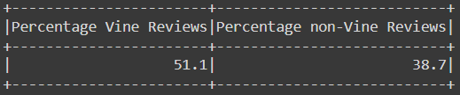
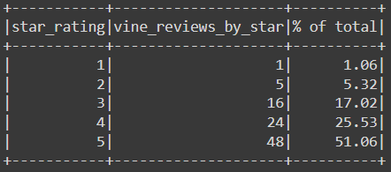
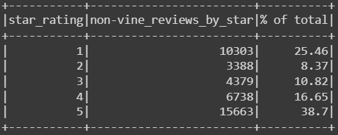

# Amazon Vine Review Analysis
*Analysis with Pyspak and AWS*

Note: Password from Amazon_Reviews_ETL.ipynb file is deleted for safety reasons. File needs pgAdmin password in order to run. 

## Project Overview
For this project I am using Amazon’s cloud service AWS, Google Colab and Pyspark to analyze Amazon reviews for video games. The purpose of this analysis is to determine if there is any bias toward favorable reviews from Vine members.  The Amazon Vine program is a service that allows manufacturers and publishers to receive reviews for their products, for an additional fee.

## Resources
Data Source

-	[Amazon Vine Reviews for video games](https://s3.amazonaws.com/amazon-reviews-pds/tsv/amazon_reviews_us_Video_Games_v1_00.tsv.gz)

Software:

-	Google Colab [Vine_Review_Analysis.ipynb](Vine_Review_Analysis.ipynb)
-	PgAdmin
-	AWS [Amazon_Reviews_ETL.ipynb](Amazon_Reviews_ETL.ipynb)

Languages:

-	pySpark

## Results
In this analysis I analyzed reviews that have more than 20 total votes and the percentage of helpful votes is equal or greater than 50.

***How many Vine reviews and non-Vine reviews were there?***

There were
- **94 Vine** reviews and 
- **40,471 non-Vine** reviews.

<i>Figure 1 & 2: Total Vine and non-Vine reviews.</i>

***How many Vine reviews were 5 stars? How many non-Vine reviews were 5 stars?***

There were
- **48** five stars **Vine** reviews and 
- **15,663**  five stars **non-Vine** reviews.

<i>Figure 3 & 4: 5-star Vine and non-Vine reviews.</i>

***What percentage of Vine reviews were 5 stars? What percentage of non-Vine reviews were 5 stars?***

- **51.1 %** of **Vine** reviews were 5 stars and 
- **38.7 %** of **non-Vine** reviews were 5 stars.

<i>Figure 5: Percentage of 5-star Vine and non-Vine reviews.</i>

## Summary

The purpose of this analysis is to analyze and determine if there is any bias towards reviews that were written as part of the Vine program. I analyzed reviews that have more than 20 total votes and the percentage of helpful votes is equal or greater than 50. This selection was made in order to pick reviews that are more likely to be helpful.

**Positivity bias for reviews in the Vine program**

In the analysis I analyzed 5-star reviews within conditions mentioned above. Calculations show that there is **positivity bias for reviews in the Vine program**. The results show that percentage of 5 stars Vine reviews is 51.1% and the percentage of 5 stars non-Vine reviews is 38.7%. **Vine reviews** have a **higher percentage** of 5 stars reviews, **12.4%** to be exact.

**Additional analyses and suggestions**

We could expand this analysis by calculating percentage for reviews by star rating. Based on the results (Figure 6 & 7), there is a larger difference in percentage for 1-star reviews than for 5-stars reviews. Vine reviews have only **1.06% of 1-star reviews**, while non-Vine reviews have **25.46% 1-star reviews** within conditions mentioned above. Similarly, there is **5.32% 2-stars Vine reviews** and **8.37% 2-stars non-Vine reviews**. 

<i>Figure 6 & 7: Percentage of reviews by star rating.</i>

The results further show the positivity bias for reviews in the Vine program, when looking at the 1 and 2-star reviews. 

Additionally, I would suggest another analysis beyond the given dataset. On the Amazon site for Vine reviews [https://www.amazon.com/gp/vine/help](https://www.amazon.com/gp/vine/help) we can find an explanation about the Vine program. The first sentence states: *“Amazon Vine invites the most trusted reviewers on Amazon to post opinions about new and pre-release items to help their fellow customers make informed purchase decisions (1).”* Vine reviews could have impact on newly released items sold on Amazon. The manufacturers will benefit from having some reviews posted when launching their newly released products, especially if the reviews are positive. At this point I would suggest to perform analysis on items that are similar (one product with Vine reviews and the other without) and measure sales increase over time. Based on that we could observe if Vine reviews contributed to sales of newly released items. 

# References
-	(1) Amazon.com https://www.amazon.com/gp/vine/help , Web 31 Oct 2020.
